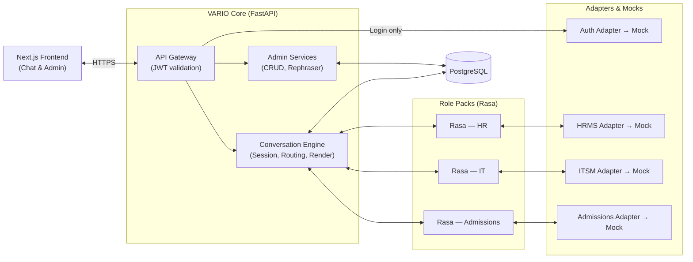
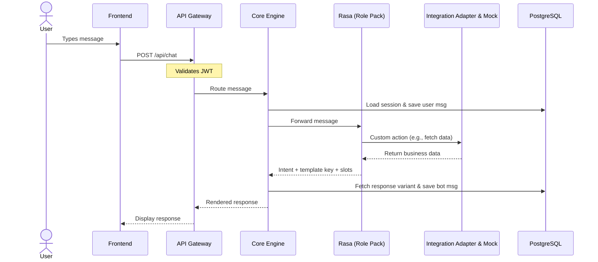
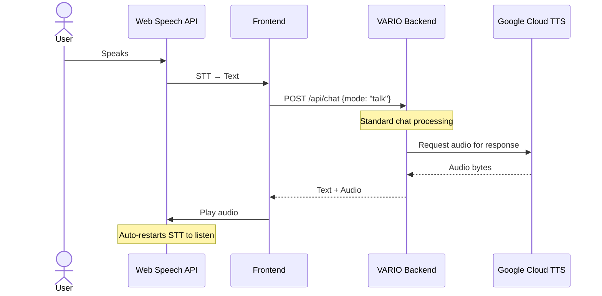
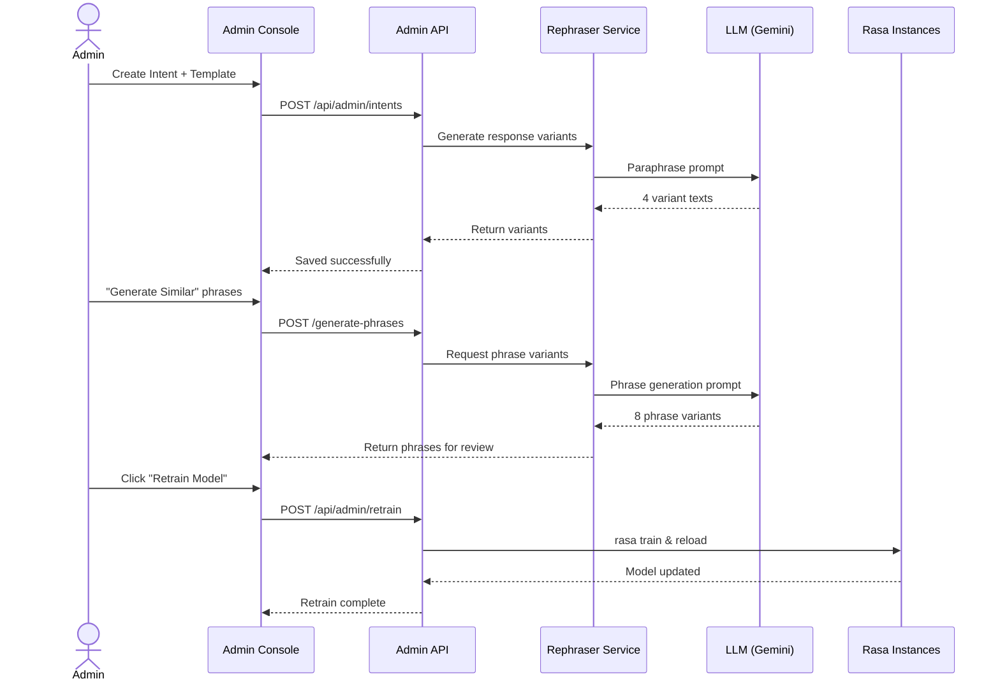

# Architecture — V.A.R.I.O (Voice Adaptive Role & Intent Orchestrator)

## Stack

- **Frontend:** Next.js (React) — Web Speech API for browser-side STT
- **Backend:** FastAPI (Python)
- **NLU Engine:** Rasa Open Source — 3 separate instances (HR, IT Support, Admissions)
- **Database:** PostgreSQL via Neon (serverless, free tier)
- **TTS:** Google Cloud Text-to-Speech (Neural2 voices)
- **Response & Phrase Variant Generation:** Provider-agnostic rephraser service (default: Gemini API via Google AI Studio free tier). Provider selectable via `REPHRASER_PROVIDER` env var.
- **Hosting — Compute:** Oracle Cloud Infrastructure Always Free (ARM Ampere A1, 4 OCPUs, 24 GB RAM)
- **Hosting — Frontend:** Vercel
- **Networking / HTTPS:** Cloudflare Tunnel
- **Auth:** Delegated to org's identity provider via Auth Adapter. Mock Auth Service for dev/demo. VARIO issues its own JWT (with embedded role claim) after org validates.
- **Local Dev:** Docker Compose (full stack)

## System flow

### High-level architecture

### Chat message flow (chat mode)

### Talk mode flow (hands-free)

### Admin flow (intent management + retraining)

## Modules

Each module is independently workable — two developers on different modules should not create merge conflicts.

- `gateway` — Single HTTP entrypoint. Schema validation, rate limiting, auth middleware, request dispatch. No business logic. Wraps all responses in `{status, data, error}` envelope.

- `auth` — Thin authentication adapter. Receives credentials from the frontend login page, forwards them to the organization's identity provider via the Auth Adapter (mock in dev, real in production). On successful validation, issues a VARIO JWT with embedded role claim (`end_user`, `hr_admin`, `it_admin`, `admissions_admin`). Verifies tokens on protected routes. No user registration, no email verification, no password reset, no account lockout — those are the org's responsibility. The Mock Auth Service is pre-seeded with test users (employees and admins) for dev and demo.

- `session-manager` — Manages per-conversation state: active form, current step, slots collected, TTL. PostgreSQL is the source of truth. Read on every incoming message, updated after every response. Session is archived when conversation ends.

- `conversation-store` — Durable conversation and message history. Handles creating conversations, appending messages (both user and bot), and listing/fetching conversation history for the dashboard. Written on every turn.

- `dialogue-router` — Pure dispatcher. Reads the conversation's `role_pack` field, forwards the message + session state to the correct Rasa instance. Passes the Rasa response to the Response Renderer. No NLU logic of its own.

- `role-pack-runtime` — Three Rasa instances (HR, IT Support, Admissions). Each handles intent classification, entity extraction, form-based slot filling, and action execution via its own Integration Adapter. Configured independently with its own training data and domain file. Pre-seeded with default intents, training phrases, and response templates.

- `integration-adapters` — One adapter per external system (`AuthAdapter`, `HRMSAdapter`, `ITSMAdapter`, `AdmissionsAdapter`). Common interface pattern (`authenticate()`, `get_leave_balance()`, `create_ticket()`, `get_application_status()`, etc.). Each adapter is the only code that knows it's talking to a mock backend. Swappable to real systems later without touching Rasa or the router.

- `response-renderer` — Given a `template_key` + `slot_values`, picks a random stored variant from `response_variants`, substitutes slot values into placeholders. Pure DB read + string substitution.

- `tts-service` — Wraps Google Cloud TTS Neural2 API. Receives response text, returns audio bytes. Only called when `mode: "talk"`. Gracefully degrades: if API credits are exhausted or the call fails, returns a flag so the frontend can fall back to chat-only.

- `admin-crud` — Create, read, update, delete for intents, training phrases, FAQs, and response templates. All operations scoped via JWT role claim. Sets `intents.needs_retrain = true` when training data changes. Calls the Rephraser Service synchronously when a response template is saved.

- `rephraser-service` — Provider-agnostic service behind a swappable interface. Provider (Gemini, OpenAI, etc.) selected via `REPHRASER_PROVIDER` env var. Two functions: (1) **Response variant generation:** called synchronously by Admin CRUD during template save — sends base text to the LLM requesting 4 paraphrased variants with placeholders preserved, validates that all placeholders survived, stores valid variants in `response_variants`. (2) **Training phrase generation:** called on-demand when an admin clicks "Generate Similar" — takes existing training phrases as seed, generates ~8 similar phrases for review. Generated phrases are NOT auto-saved; the admin reviews and accepts/edits/rejects each one.

- `retraining-service` — Triggered manually by an admin clicking "Retrain" in the console. Reads intents + training phrases for the specified role pack from PostgreSQL, converts to Rasa YAML training format, runs `rasa train`, and reloads the model into the corresponding Rasa instance. Clears the `needs_retrain` flag on completion.

- `audit-log` — Write-only sink for business-significant events (leave submitted, ticket created, password reset initiated, admin edited a template). Receives `{actor_id, role_pack, action_type, reference_id, details}` from other modules. Fire-and-forget, no client-facing response.

## API contract

The full endpoint contract lives in [`docs/api-contract.md`](file:///Users/juwariya/dev/vario/docs/api-contract.md). Summary of key routes:

| Method | Path | Module | Description |
|---|---|---|---|
| POST | `/api/auth/login` | auth | Login — forwards to org auth via adapter, issues VARIO JWT |
| GET | `/api/conversations` | conversation-store | List user's conversations |
| POST | `/api/conversations` | conversation-store | Start a new conversation (with role_pack) |
| GET | `/api/conversations/:id/messages` | conversation-store | Fetch message history |
| POST | `/api/chat` | gateway → router | Send a message (chat or talk mode) |
| GET | `/api/admin/intents` | admin-crud | List intents for admin's role pack |
| POST | `/api/admin/intents` | admin-crud | Create intent + phrases + template + generate variants |
| PUT | `/api/admin/intents/:id` | admin-crud | Update intent |
| DELETE | `/api/admin/intents/:id` | admin-crud | Delete intent |
| POST | `/api/admin/intents/:id/generate-phrases` | rephraser-service | Generate training phrase variants |
| GET | `/api/admin/templates` | admin-crud | List response templates |
| PUT | `/api/admin/templates/:id` | admin-crud | Update a response template |
| PUT | `/api/admin/variants/:id` | admin-crud | Edit a response variant's text |
| DELETE | `/api/admin/variants/:id` | admin-crud | Delete a response variant |
| POST | `/api/admin/retrain` | retraining-service | Trigger manual retraining (role pack from JWT) |
| GET | `/api/admin/retrain/:job_id` | retraining-service | Check retrain job status |
| GET | `/api/admin/conversations` | conversation-store | List conversations in admin's role pack (FR-19) |
| GET | `/api/admin/conversations/:id/messages` | conversation-store | Read-only transcript for one conversation |
| GET | `/api/admin/audit-log` | audit-log | View audit log entries |

## Data model

9 entities — described inline below.

- `users` — Lightweight cache of org users, upserted on first login from the org auth response. Stores `user_id`, `email`, `full_name`, `role`, `external_id`, `created_at`. Has many `conversations`, `training_phrases`, `response_templates`, `audit_log`.
- `conversations` — belongs to `users`, has many `messages`, has one `sessions`
- `messages` — belongs to `conversations`. Stores `sender` (user/bot), `intent_name`, `confidence`, `entities` (JSONB)
- `sessions` — belongs to `conversations` (1:1). Stores `current_form`, `current_step`, `slots` (JSONB), `expires_at`. PostgreSQL is the source of truth — no in-memory cache.
- `intents` — scoped by `role_pack`. Carries `needs_retrain` flag and `intent_type` (`dynamic_workflow` or `static_faq`). Workflows are pre-seeded and locked; FAQs are fully editable by admins.
- `training_phrases` — belongs to `intents`, authored by `users` (admin)
- `response_templates` — scoped by `role_pack`. Carries `template_key`, `base_text`, `allow_rephrasing` flag, and `available_variables` (an array of strings like `["ticket_id", "status"]` used by the UI to show read-only badges).
- `response_variants` — belongs to `response_templates`. Stores `variant_text`. Each template has **5** rows: the original `base_text` stored as variant index 0 (never deleted) plus **4** paraphrases auto-generated by the Rephraser Service. Admins can individually edit or delete the generated variants after generation.
- `audit_log` — append-only. References `users` as actor. Stores `action_type`, `reference_id`, and `details` (JSONB).

## Constraints

- **Expected scale:** 20 concurrent user sessions during a live demo. Not designed for production-scale traffic.
- **Performance:** 95% of queries return a response within 2 seconds (excluding artificial mock API delays). TTS adds ~1–2 seconds for talk mode. Template save with variant generation takes ~3–5 seconds (LLM API round-trip).
- **Security:** JWT on all protected routes. Admin endpoints scoped by role claim — an HR admin cannot access IT intents. Secrets in `.env`, never hardcoded. Rate limiting on the API Gateway.
- **Auth:** Authentication is delegated to the organization's identity provider. The Mock Auth Service is pre-seeded with test user accounts for dev and demo. In production, user provisioning is handled by the org's identity system.
- **Extensibility:** Adding a new role pack (e.g., Finance) requires: a new Rasa instance with its own training data, a new Integration Adapter implementation, and configuration entries in the DB — no core engine code changes.
- **Not needed:** Offline mode, native mobile apps, multi-language support, proactive push notifications, real enterprise system integrations, user registration/password management (org's responsibility).