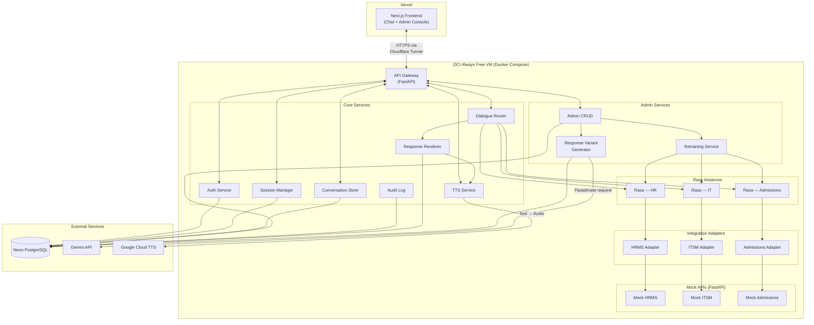
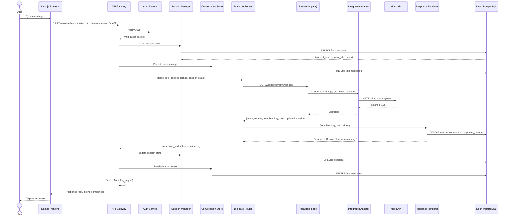
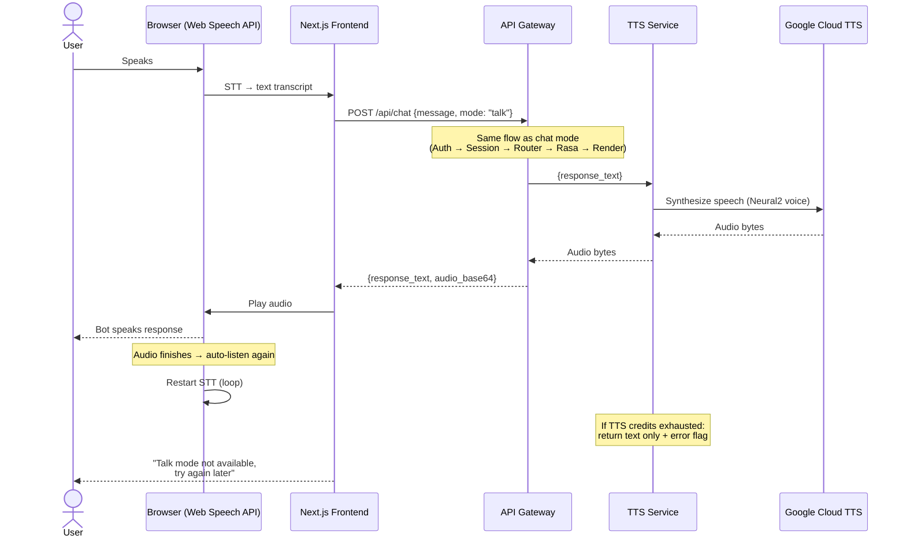
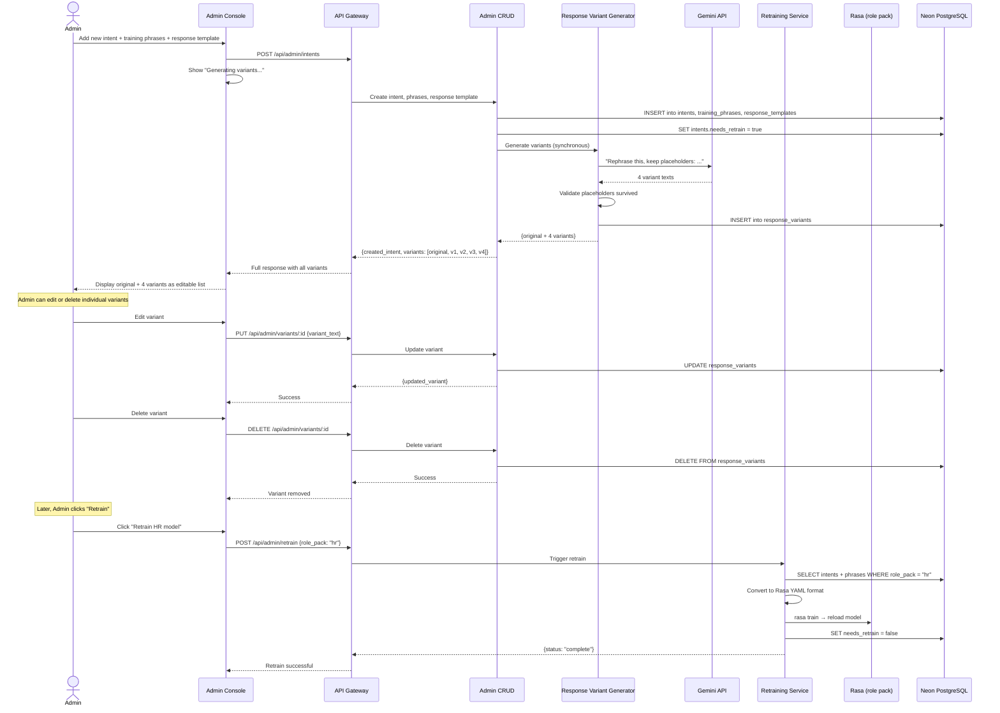

# Architecture — V.A.R.I.O (Voice Adaptive Role & Intent Orchestrator)

## Stack

- **Frontend:** Next.js (React) — Web Speech API for browser-side STT
- **Backend:** FastAPI (Python)
- **NLU Engine:** Rasa Open Source — 3 separate instances (HR, IT Support, Admissions)
- **Database:** PostgreSQL via Neon (serverless, free tier)
- **TTS:** Google Cloud Text-to-Speech (Neural2 voices)
- **Response Variant Generation:** Gemini API (Google AI Studio free tier)
- **Hosting — Compute:** Oracle Cloud Infrastructure Always Free (ARM Ampere A1, 4 OCPUs, 24 GB RAM)
- **Hosting — Frontend:** Vercel
- **Networking / HTTPS:** Cloudflare Tunnel
- **Auth:** Custom JWT (issued by Auth Service, role claim embedded)
- **Email:** Gmail SMTP (via Python `smtplib`, App Password authentication)
- **Local Dev:** Docker Compose (full stack)

## System flow

### High-level architecture

### Chat message flow (chat mode)

### Talk mode flow (hands-free)

### Admin flow (intent management + retraining)

## Modules

Each module is independently workable — two developers on different modules should not create merge conflicts.

- `gateway` — Single HTTP entrypoint. Schema validation, rate limiting, auth middleware, request dispatch. No business logic. Wraps all responses in `{status, data, error}` envelope.

- `auth` — Register and login. Self-registration via `/api/auth/register` always assigns `end_user` role — there is no way to self-register as an admin. On registration, a verification email is sent via Gmail SMTP; the account is created with `email_verified = false` and the user cannot log in until verified. Initial admin accounts are created by a seed script on first deployment (credentials read from `.env`, pre-verified). After that, existing admins can create new admin accounts for their own department via the admin console (pre-verified). Issues JWT with embedded role claim (`end_user`, `hr_admin`, `it_admin`, `admissions_admin`). Verifies tokens on protected routes. Passwords hashed with bcrypt. Includes forgot-password flow: generates a time-limited reset token (15-minute expiry), sends a reset link via Gmail SMTP, and verifies the token on submission. Enforces account lockout after 3 consecutive failed login attempts — account is locked for 15 minutes. Successful login resets the attempt counter. All tokens (email verification and password reset) are stored in a shared `auth_tokens` table with a `type` discriminator.

- `session-manager` — Manages per-conversation state: active form, current step, slots collected, TTL. PostgreSQL is the source of truth. Read on every incoming message, updated after every response. Session is archived when conversation ends.

- `conversation-store` — Durable conversation and message history. Handles creating conversations, appending messages (both user and bot), and listing/fetching conversation history for the dashboard. Written on every turn.

- `dialogue-router` — Pure dispatcher. Reads the conversation's `role_pack` field, forwards the message + session state to the correct Rasa instance. Passes the Rasa response to the Response Renderer. No NLU logic of its own.

- `role-pack-runtime` — Three Rasa instances (HR, IT Support, Admissions). Each handles intent classification, entity extraction, form-based slot filling, and action execution via its own Integration Adapter. Configured independently with its own training data and domain file.

- `integration-adapters` — One adapter per department (`HRMSAdapter`, `ITSMAdapter`, `AdmissionsAdapter`). Common interface (`get_leave_balance()`, `create_ticket()`, `get_application_status()`, etc.). Each adapter is the only code that knows it's talking to a mock backend. Swappable to real systems later without touching Rasa or the router.

- `response-renderer` — Given a `template_key` + `slot_values`, picks a random stored variant from `response_variants`, substitutes slot values into placeholders. Pure DB read + string substitution.

- `tts-service` — Wraps Google Cloud TTS Neural2 API. Receives response text, returns audio bytes. Only called when `mode: "talk"`. Gracefully degrades: if API credits are exhausted or the call fails, returns a flag so the frontend can fall back to chat-only.

- `admin-crud` — Create, read, update, delete for intents, training phrases, FAQs, and response templates. Also handles creating new admin accounts scoped to the creator's own department. All operations scoped via JWT role claim. Sets `intents.needs_retrain = true` when training data changes. Calls the Response Variant Generator synchronously when a response template is saved.

- `response-variant-generator` — Called synchronously by Admin CRUD during template save. Sends the base response text to the Gemini API requesting 4 paraphrased variants with placeholders preserved. Validates that all placeholders survived rephrasing. Stores valid variants in `response_variants` and returns all 5 versions (1 original + 4 variants) to the frontend. Admins can then individually edit or delete any generated variant from the admin console.

- `retraining-service` — Triggered manually by an admin clicking "Retrain" in the console. Reads intents + training phrases for the specified role pack from PostgreSQL, converts to Rasa YAML training format, runs `rasa train`, and reloads the model into the corresponding Rasa instance. Clears the `needs_retrain` flag on completion.

- `audit-log` — Write-only sink for business-significant events (leave submitted, ticket created, password reset initiated, admin edited a template). Receives `{actor_id, role_pack, action_type, reference_id, details}` from other modules. Fire-and-forget, no client-facing response.

## API contract

The full endpoint contract lives in [`docs/api-contract.md`](file:///Users/juwariya/dev/vario/docs/api-contract.md). Summary of key routes:

| Method | Path | Module | Description |
|---|---|---|---|
| POST | `/api/auth/register` | auth | Register end user (unverified), sends verification email |
| POST | `/api/auth/verify-email` | auth | Verify email using token from link |
| POST | `/api/auth/resend-verification` | auth | Resend verification email |
| POST | `/api/auth/login` | auth | Login, receive JWT (blocks unverified, locks after 3 failures) |
| POST | `/api/auth/forgot-password` | auth | Request a password reset link via email |
| POST | `/api/auth/reset-password` | auth | Reset password using a valid token |
| GET | `/api/conversations` | conversation-store | List user's conversations |
| POST | `/api/conversations` | conversation-store | Start a new conversation (with role_pack) |
| GET | `/api/conversations/:id/messages` | conversation-store | Fetch message history |
| POST | `/api/chat` | gateway → router | Send a message (chat or talk mode) |
| POST | `/api/admin/users` | admin-crud | Create a new admin for the creator's department |
| GET | `/api/admin/intents` | admin-crud | List intents for admin's role pack |
| POST | `/api/admin/intents` | admin-crud | Create intent + phrases + template + generate variants |
| PUT | `/api/admin/intents/:id` | admin-crud | Update intent |
| DELETE | `/api/admin/intents/:id` | admin-crud | Delete intent |
| GET | `/api/admin/templates` | admin-crud | List response templates |
| PUT | `/api/admin/templates/:id` | admin-crud | Update a response template |
| PUT | `/api/admin/variants/:id` | admin-crud | Edit a response variant's text |
| DELETE | `/api/admin/variants/:id` | admin-crud | Delete a response variant |
| POST | `/api/admin/retrain` | retraining-service | Trigger manual retraining |
| GET | `/api/admin/retrain/:job_id` | retraining-service | Check retrain job status |
| GET | `/api/admin/audit-log` | audit-log | View audit log entries |

## Data model

10 entities — full ER diagram at [`vario_database_erd.html`](file:///Users/juwariya/dev/vario/vario_database_erd.html).

- `users` — has many `conversations`, `training_phrases`, `response_templates`, `audit_log`, `auth_tokens`. Carries `email_verified` (boolean, default false), `failed_login_attempts` (integer, default 0), and `locked_until` (nullable timestamp). Seeded admins and admin-created accounts are pre-verified.
- `conversations` — belongs to `users`, has many `messages`, has one `sessions`
- `messages` — belongs to `conversations`. Stores `sender` (user/bot), `intent_name`, `confidence`, `entities` (JSONB)
- `sessions` — belongs to `conversations` (1:1). Stores `current_form`, `current_step`, `slots` (JSONB), `expires_at`. PostgreSQL is the source of truth — no in-memory cache.
- `intents` — has many `training_phrases`. Scoped by `role_pack`. Carries `needs_retrain` flag.
- `training_phrases` — belongs to `intents`, authored by `users` (admin)
- `response_templates` — scoped by `role_pack`. Carries `template_key`, `base_text`, `allow_rephrasing` flag. Updated by `users` (admin).
- `response_variants` — belongs to `response_templates`. Auto-generated by the Response Variant Generator (4 per template). Stores `variant_text`. Admins can individually edit or delete variants after generation.
- `auth_tokens` — belongs to `users`. Stores `token_hash`, `type` (`email_verification` | `password_reset`), `used` flag, `expires_at`, and `created_at`. Email verification tokens expire after 24 hours; password reset tokens expire after 15 minutes.
- `audit_log` — append-only. References `users` as actor. Stores `action_type`, `reference_id`, and `details` (JSONB).

## Constraints

- **Expected scale:** 20 concurrent user sessions during a live demo. Not designed for production-scale traffic.
- **Performance:** 95% of queries return a response within 2 seconds (excluding artificial mock API delays). TTS adds ~1–2 seconds for talk mode. Template save with variant generation takes ~3–5 seconds (Gemini API round-trip).
- **Security:** JWT on all protected routes. Admin endpoints scoped by role claim — an HR admin cannot access IT intents. Self-registration always assigns `end_user` role. Admin accounts are seeded on first deploy or created by existing admins. Account lockout after 3 consecutive failed login attempts (15-minute cooldown). Password reset tokens expire after 15 minutes. Secrets in `.env`, never hardcoded. Rate limiting on the API Gateway.
- **Deployment prerequisite:** A seed script (`seed_admins.py`) must run on first deployment to create initial admin accounts. Credentials are read from environment variables. Gmail SMTP credentials (`SMTP_EMAIL`, `SMTP_APP_PASSWORD`) must be set for password reset emails.
- **Extensibility:** Adding a new role pack (e.g., Finance) requires: a new Rasa instance with its own training data, a new Integration Adapter implementation, and configuration entries in the DB — no core engine code changes.
- **Not needed:** Offline mode, native mobile apps, multi-language support, SSO, proactive push notifications, real enterprise system integrations.